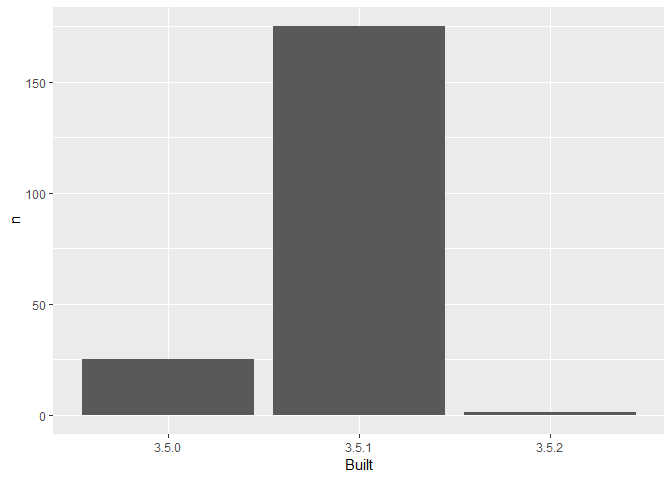

03\_barchart-packages-built.R
================
kknight1
Tue Jan 15 17:15:15 2019

``` r
## remember to restart R here!
library(tidyverse)
```

    ## -- Attaching packages ------------------------ tidyverse 1.2.1 --

    ## v ggplot2 3.1.0     v purrr   0.2.5
    ## v tibble  1.4.2     v dplyr   0.7.8
    ## v tidyr   0.8.1     v stringr 1.3.1
    ## v readr   1.1.1     v forcats 0.3.0

    ## -- Conflicts --------------------------- tidyverse_conflicts() --
    ## x dplyr::filter() masks stats::filter()
    ## x dplyr::lag()    masks stats::lag()

``` r
library(here)
```

    ## here() starts at C:/Users/kknight1/Documents/R/packages-report

``` r
## make a barchart from the frequency table in data/add-on-packages-freqtable.csv

apt_freqtable <- read_csv(here::here("data","add-on-packages-freqtable.csv"))
```

    ## Parsed with column specification:
    ## cols(
    ##   Built = col_character(),
    ##   n = col_integer(),
    ##   prop = col_double()
    ## )

``` r
## read that csv into a data frame
## hint: readr::read_csv() or read.csv()
## idea: try using here::here() to create the file path

## if you use ggplot2, code like this will work:
ggplot(apt_freqtable, aes(x = Built, y = n)) +
  geom_col()
```

<!-- -->

``` r
## write this barchart to figs/built-barchart.png
## if you use ggplot2, ggsave() will help
## idea: try using here::here() to create the file path

ggsave(here::here("figs","built-barchart.png"))
```

    ## Saving 7 x 5 in image

``` r
## YES overwrite the file that is there now
## that's old output from me (Jenny)
```
